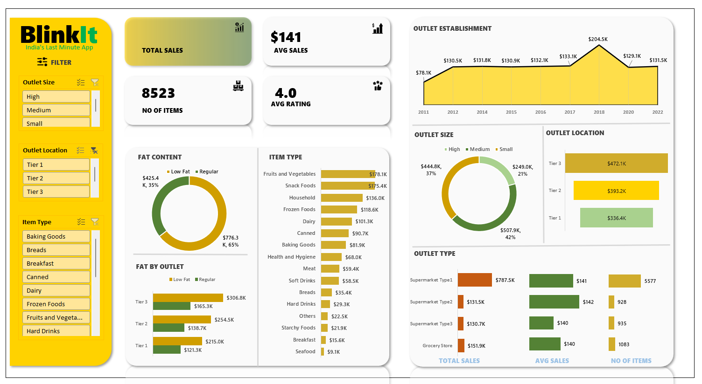

# Blinkit-Analyzed-Report
An Excel-based data analysis project on Blinkit grocery sales. The dataset was cleaned and analyzed using pivot tables, formulas, and charts to study item-wise sales, outlet performance, and key factors influencing revenue. The project highlights practical Excel data analysis and visualization skills.

